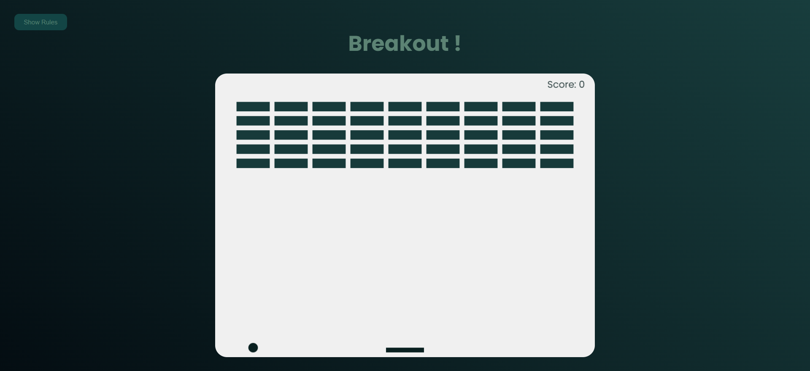
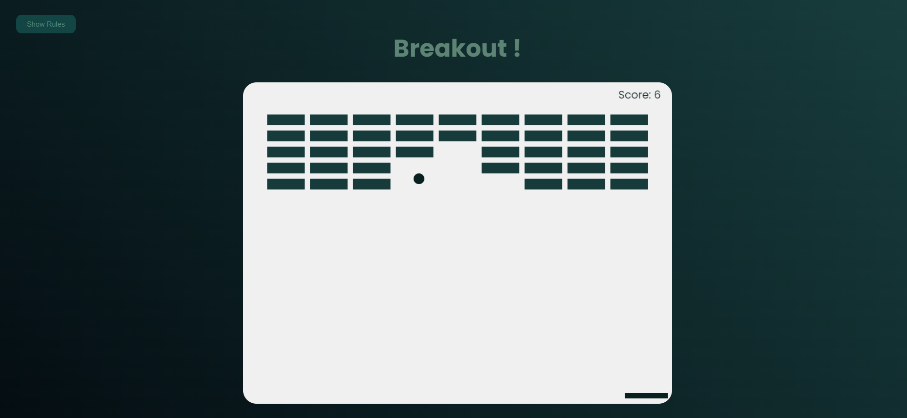
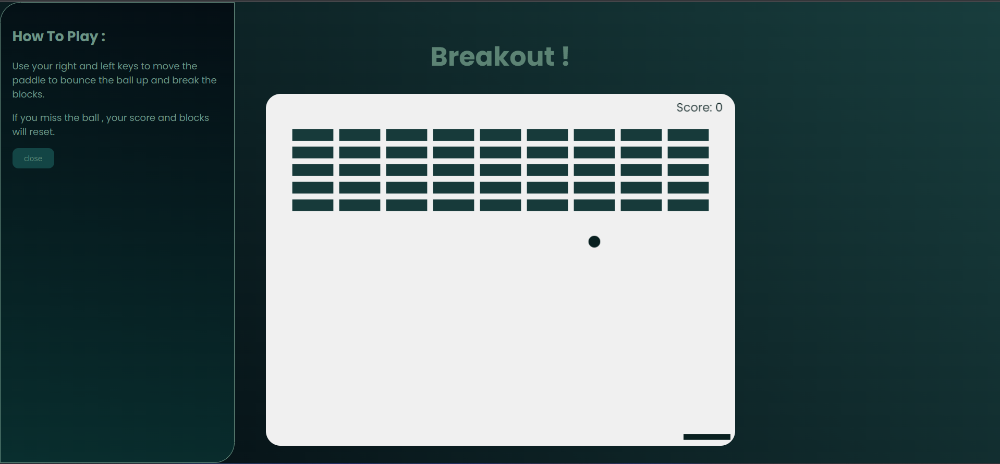

<h1>Breakout Game</h1>
    

        
        
        
    

    <h3>Description</h3>
    

      This simple game is created using web technologies such as HTML, CSS, and
      JavaScript, utilizing the canvas method for rendering graphics and
      executing game operations. In this game, your objective is to play with a
      ball, rebound it off a paddle in front of you, and eliminate all the
      blocks on the screen.
    

    <h3>Requirements</h3>

To run this game, you only need a web browser.

<h2>Installation and Execution</h2>
    
To run this project locally, follow these steps:

    <ol>
      <li>
        
 Download or clone the game repository from:

        <pre><code> git clone https://github.com/Hanieh-Sadeghi/Breakout-Game.git </code></pre>
        
2. Open the index.html file in your web browser.

      </li>
    </ol>
